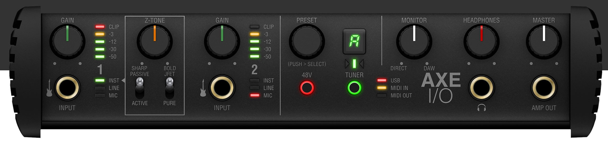
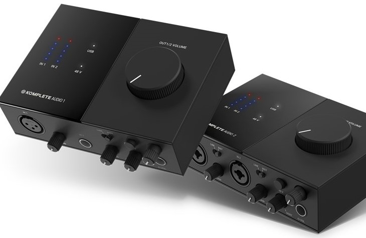

## Pourquoi se tourner vers les simulateurs
- Parce que vous avez des enfants, des voisins une conjointe et qu'ils ne souhaitent pas vous entendre jouer tard le soir ou répéter le même passage 75 fois de suite
- Parce que vous voulez cibler vos besoins, experimenter des effets, ajuster votre niveau de saturation sans toujours achaler le gars du magasin de musique
- Parce que lorsque l'idée géniale frappe, vous voulez être prêt à l'enregistrer et l'envoyer à votre groupe

## Ce que vous avez besoin
### Une guitare

N'importe quelle guitare qui se branche fera l'affaire

### Une interface audio

  

    

    

    

  

Une interface audio est une boite qui permet de connecter sa guitare avec le fil _Jack 1/4_ à l'ordinateur via le port USB). Certains modèles comme ceux illustrés ci-dessus sont livrés avec des clés de license pour certains logiciels donc à considérer lors de l'achat.

### Une station audionumérique

Une station audionumérique, acronyme DAW, de l'anglais digital audio workstation (J'utilise [Ableton Live 10 lite](https://www.ableton.com/en/products/live-lite/features/)) et des _plugins_  ou un logiciel dédié (Amplitube, Guitar Rig)
    - Note: On peut utiliser ces logiciels directement dans le DAW

